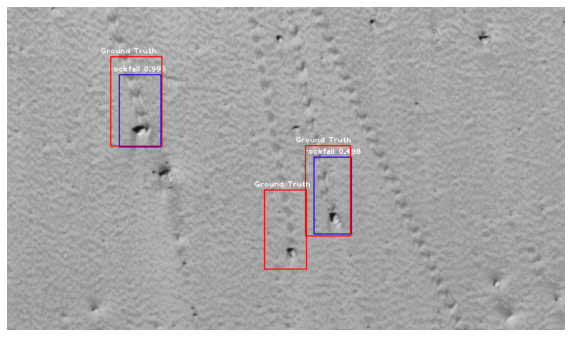

# 月・火星表面の物体検知
RetinaNetを用いた月・火星表面の物体検知アルゴリズムを実装しました。

これらの論文を参考にしました。

[A Labeled Image Dataset for Deep Learning-Driven Rockfall Detection on the Moon and Mars](https://www.frontiersin.org/articles/10.3389/frsen.2021.640034/full)

[Deep Learning-Driven Detection and Mapping of
Rockfalls on Mars](https://ieeexplore.ieee.org/abstract/document/9103997)

[Automated Detection of Lunar Rockfalls Using
a Convolutional Neural Network](https://ieeexplore.ieee.org/document/8587120)

RetinaNetにはこちらのkeras実装を参考にしていますhttps://github.com/fizyr/keras-retinanet

モデル評価ではこちらの実装を参考にしています　https://github.com/nekobean/pascalvoc_metrics/

月・火星表面の物体検知用データセットはこちらからダウンロードできます。https://edmond.mpdl.mpg.de/dataset.xhtml?persistentId=doi:10.17617/3.7BXEVC

また、クレーター検知ではこちらのデータセットが使えます。注意として、ラベルの形式が違うので、"xyrb"形式" （ground truth の矩形: <ラベル名> <xmin> <ymin> <xmax> <ymax>
検出した矩形: <ラベル名> <スコア> <xmin> <ymin> <xmax> <ymax>）に直す必要があります。https://www.kaggle.com/datasets/lincolnzh/martianlunar-crater-detection-dataset

# データセット
データセットはground truthのラベルcsvファイルを　dataset/moon/train_labels/train_labels_m.csv　に,

クラスcsvファイルを　dataset/moon/train_labels/train_classes.csv　に,

画像データは　dataset/moon/train_labels/train_images　の下に入れてください

テストデータは"train"を"test"に書き換えて同様に入れてください

# 実装例
  実装例として[このノートブック](https://github.com/zushi0516/object_detection_moon_mars/blob/main/examples/training.ipynb)を使ってcolab上で訓練、推論、モデルの定量評価を行うことができます。

推論がうまくいくとこのような結果を得ることができます。
  

